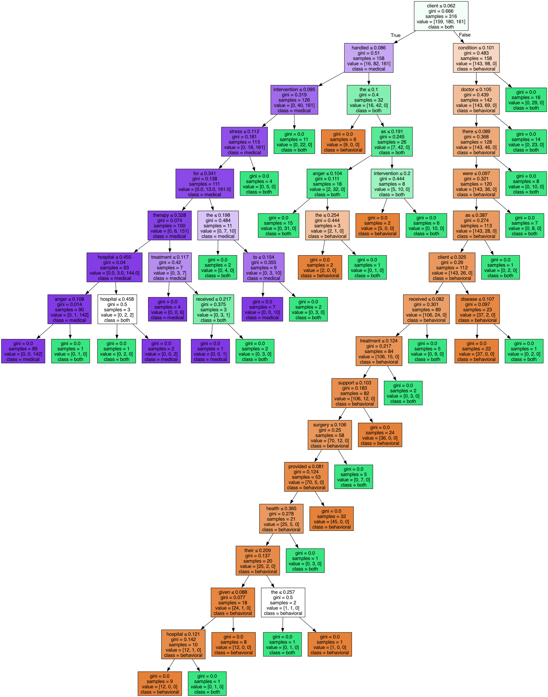
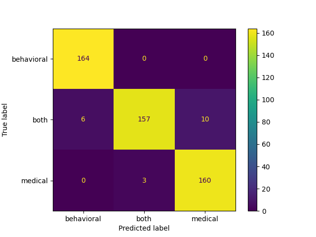

# TF-IDF Random Forest Classification
A script by Aussie Frost. Updated on Sept 19, 2024.

## Objective
Create a multi-class classification model to classify Modes of Intervention (MoI) for CAHOOTS case narratives.

## Summary
The file [classification.py](classification.py) is a implementation of classifying case narratives that were processed using TF-IDF (Term Frequency-Inverse Document Frequency) vectorization and Random Forest classification. 

## Data
The dataset was randomly generated by GPT 4o. It contains 1,000 faux case narratives containing details about each case. For each row, or case, there are two columns. Column x contains the details on the case. Column y contains a MoI label.

## Preprocessing
The text contained in column x was preprocessed using TF-IDF (Term Frequency-Inverse Document Frequency) Vectorization. In this case, the top 100 relevant features of each case were extracted in the form of a vector that will be used for the Random Forest classification.

The data is split into a 70/30 train and test set.

## Classification
Classification is performed using a Random Forest using the top 100 estimators.

## Results
The model performs at 96% accuracy, indicating successful multi-class classification of MoI. Test results are output in `data/dummy_case_narratives_results.csv`. Model scores and misses are output to the log file `output/dummy_case_narratives_performance.log`.

The decision tree that won took the following form:

Additionally, we can understand the performance by looking at a confusion matrix:

## Next steps
- Expand script to capture the multi-dimensional CAHOOTS data